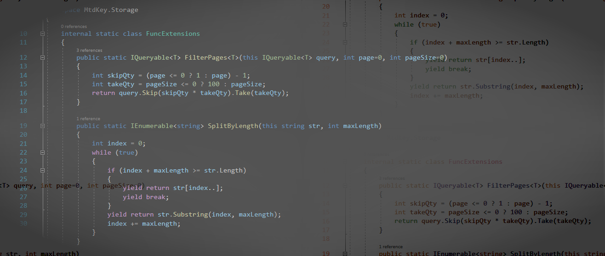

  

### Hi there 👋

<!--
**olegbruev/olegbruev** is a ✨ _special_ ✨ repository because its `README.md` (this file) appears on your GitHub profile.

Here are some ideas to get you started:

- 🔭 I’m currently working on ...
- 🌱 I’m currently learning ...
- 👯 I’m looking to collaborate on ...
- 🤔 I’m looking for help with ...
- 💬 Ask me about ...
- 📫 How to reach me: ...
- 😄 Pronouns: ...
- ⚡ Fun fact: ...
-->

I’m Oleg, Full Stack .NET Developer / Architect and my particularly specialty 💼 is business application development. My forte back-ends design and data analysis. I love building web applications that make thing easier for everyone.

🗃️ My repositories contain code and applications that can help improve business processes or speed up application development. 
 
💬 If you are having trouble using my code, please email me or create issue.
 
🙏🏻 Please point out my mistakes
